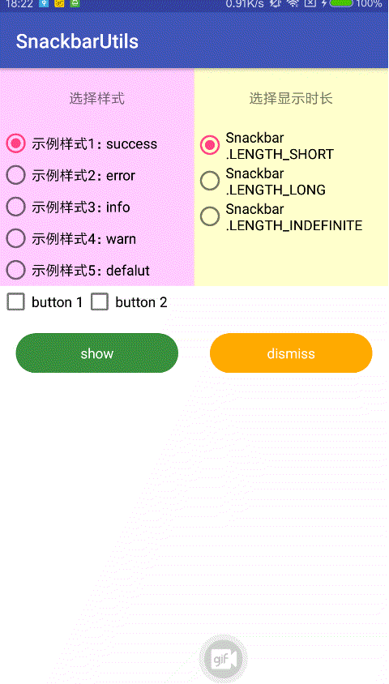
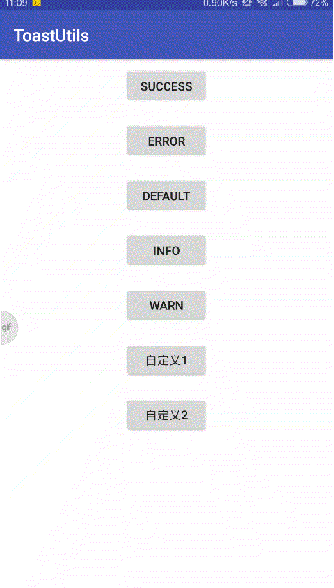

# SnackbarUtils 

#### 效果图  欢迎star 欢迎frok


### 使用方式
#### Step 1. Add the JitPack repository to your build file
``` 
allprojects {
    repositories {
        ...
        maven { url 'https://jitpack.io' }
    }
}
```
#### Step 2. Add the dependency

```  
dependencies {
    implementation 'com.android.support:design:27.1.0'
    compile 'com.github.mengpeng920223:SnackbarUtils:v1.0.0'
}
```

#### 使用示例
```
SnackbarUtils
    .create(MainActivity.this)           //  .create(Activity activity) 必须
    .setIcon(R.mipmap.toast_error)       //  左边的icon
    .setContent("失败")                   //  提示文字
    .setSnackbarBackgroundColor(R.color.toastErrorColor)  // 背景颜色
    .setActionBtn1("按钮1", new View.OnClickListener() {  // 按钮1
        @Override
        public void onClick(View v) {
            Log.d("MainActivity", "按钮1");
        }
    })
    .setActionBtn2("按钮2", new View.OnClickListener() {  // 按钮2
        @Override
        public void onClick(View v) {
            Log.d("MainActivity", "按钮2");
        }
    })
    .setDuration(Snackbar.LENGTH_INDEFINITE)  //设置显示时长
    .build();  //创建并show  必须调用
```

#### 推荐 [ToastUtils](https://gitee.com/mengpeng920223/ToastUtils)
是时候改变一下你的toast了，让你的toast变个样子吧。最简单炫酷的toast,一行代码实现多种提示，关键是简单，好看，你值得拥有。
