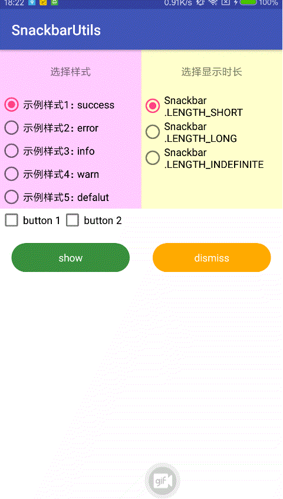
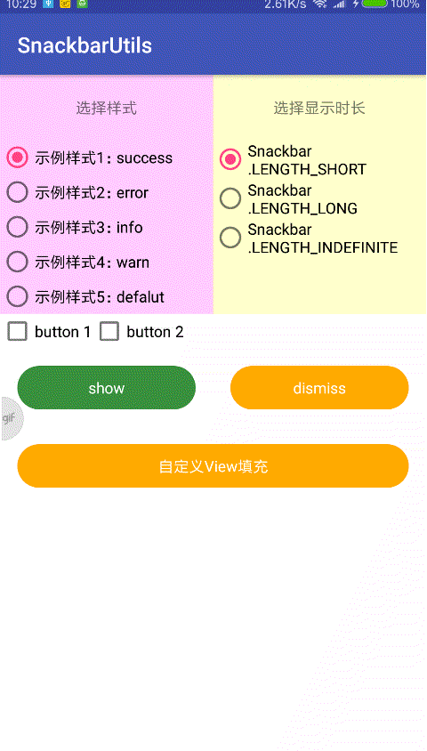

# SnackbarUtils

版本规划：
-
- v1.0.0 采用建造者模式实现Snackbar的使用，添加多彩的示例
- v1.1.0 增加可以自定义显示的view,优化细节以及修复重复绘制，提升性能
- v1.2.0 增加snackbar与各种控件的联动等【当snackbar弹出的时候，指定控件上移】
- v..... 欢迎留言，欢迎制定版本规划，一起打造漂亮的snackbar

#### 效果图   欢迎star 欢迎frok




### 使用方式
#### Step 1. Add the JitPack repository to your build file
``` 
allprojects {
    repositories {
        ...
        maven { url 'https://jitpack.io' }
    }
}
```
#### Step 2. Add the dependency

```  
dependencies {
    //依赖库
    implementation 'com.android.support:design:27.1.0'
    compile 'com.github.mengpeng920223:SnackbarUtils:v1.1.0'
}
```

#### 使用示例 V1.1.0
- 新增使用自定义view
```  
View inflate = LayoutInflater.from(this).inflate(R.layout.item_view, null);
SnackbarUtils
    //第一个参数：activity ， 第二个：自定义的view ， 第三个：view的高度，单位是dp
    .create(MainActivity.this, inflate, 100)
    .setDuration(time)  //设置显示时长
    .build();  //创建并show  必须调用
    
..... = inflate.findViewById(...);   
.....
    
```
- 优化体验，修复重复绘制

#### 使用示例 V1.0.0
```
SnackbarUtils
    .create(MainActivity.this)           //  .create(Activity activity) 必须
    .setIcon(R.mipmap.toast_error)       //  左边的icon
    .setContent("失败")                   //  提示文字
    .setSnackbarBackgroundColor(R.color.toastErrorColor)  // 背景颜色
    .setActionBtn1("按钮1", new View.OnClickListener() {  // 按钮1
        @Override
        public void onClick(View v) {
            Log.d("MainActivity", "按钮1");
        }
    })
    .setActionBtn2("按钮2", new View.OnClickListener() {  // 按钮2
        @Override
        public void onClick(View v) {
            Log.d("MainActivity", "按钮2");
        }
    })
    .setDuration(Snackbar.LENGTH_INDEFINITE)  //设置显示时长
    .build();  //创建并show  必须调用
```

#### 推荐 [ToastUtils](https://gitee.com/mengpeng920223/ToastUtils)
是时候改变一下你的toast了，让你的toast变个样子吧。最简单炫酷的toast,一行代码实现多种提示，关键是简单，好看，你值得拥有。
